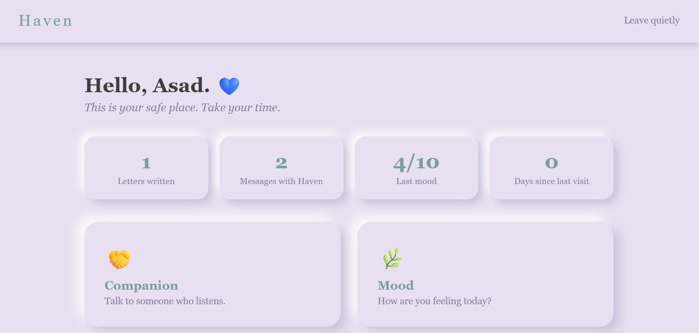
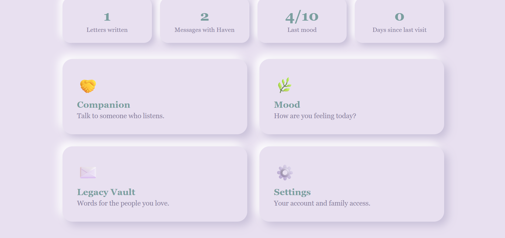
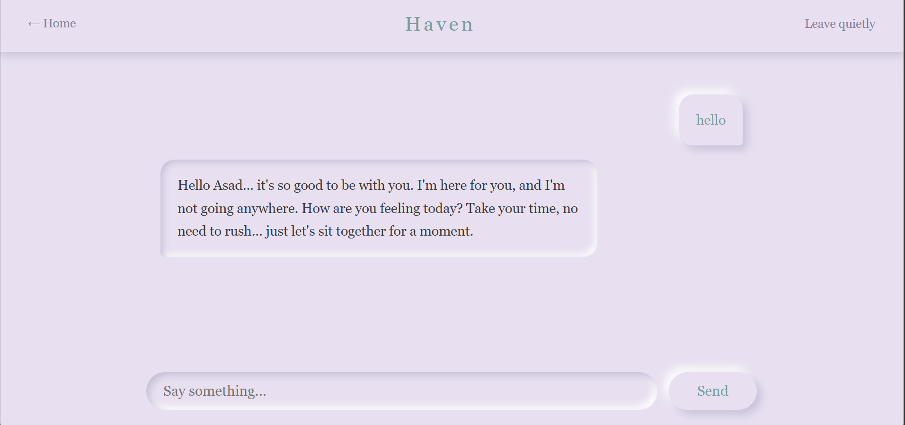
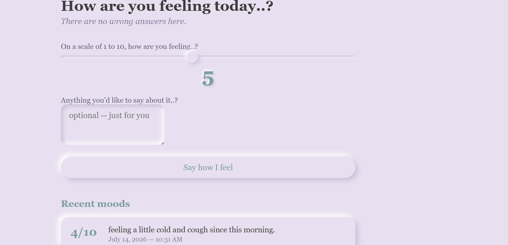
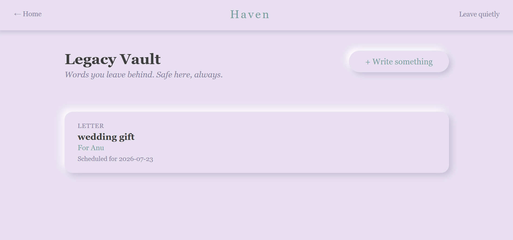
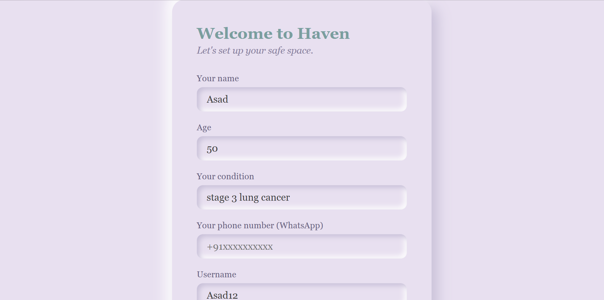
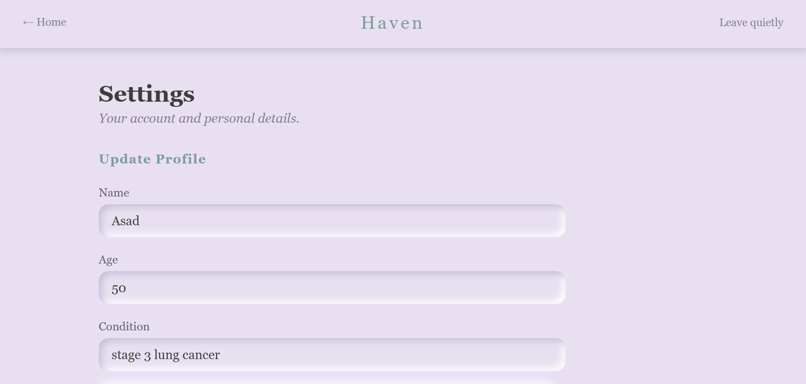
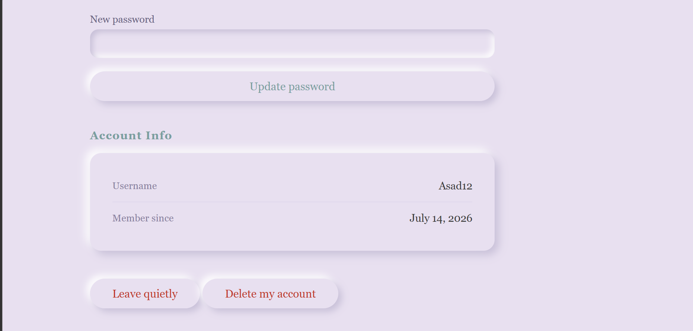

# Haven 💙
### *A safe place for everything unsaid.*

---

## Why I Built This

My father went through a serious illness. Sitting with him in hospital waiting rooms, I met others like him — people carrying so much they wanted to say, with no quiet place to say it. They wanted to talk, but didn't want to burden their families. They wanted to leave something behind, but didn't know how.

Haven is my attempt to give them that place.

---

## What It Does

Haven is an AI-powered emotional companion for patients in their final days. It gives them someone to talk to, a place to track their feelings, and a way to leave their words behind for the people they love — delivered at exactly the right moment.

---

## Screenshots

**Dashboard**



**AI Companion**


**Mood Tracker**


**Legacy Vault**


**Registration**


**Settings**



---

## Features

**🤝 AI Companion**
Powered by Groq's LLaMA 3.3 70B. Haven knows the patient's name, age, and condition. It remembers every conversation and responds with warmth and patience — like a trusted friend who has been paying attention. It never gives medical advice. It never rushes. It just listens.

**🌿 Mood Tracker**
Log how you're feeling on a 1–10 slider with an optional note. Haven quietly monitors entries. If a score is critically low or the note contains concerning words, Haven responds with a gentle message of support.

**✉️ Legacy Vault**
Write letters, memories, and wishes for the people you love. Set a delivery date — a birthday, a wedding, an anniversary — or leave it blank and Haven delivers them when the time comes. Every letter gets a unique private link for the recipient.

**📬 Automated Delivery**
- On a scheduled date — birthdays, anniversaries, graduations
- After 14 days of inactivity — Haven assumes the patient can no longer visit
- Via email (SendGrid) — warm HTML template
- Via WhatsApp (Twilio) — a gentle nudge to check their inbox
- As a PDF (ReportLab) — all letters compiled into one vault document

**🔗 Family Access Page**
Every letter generates a unique UUID link. Family members open it directly from their email — no Haven account needed. They see the letter exactly as it was written.

**📊 Dashboard Stats**
- Total letters written
- Total messages shared with Haven
- Last recorded mood score
- Days since last visit

**🔒 Activity Monitor**
APScheduler runs every 24 hours. 7 days inactive → gentle reminder to patient. 14 days inactive → all letters delivered automatically.

**⚙️ Account Management**
- Update profile details
- Change password
- Forgot password via WhatsApp OTP (6-digit, 10-minute expiry)
- Delete account and all data permanently

---

## Tech Stack

| Layer | Technology |
|---|---|
| Language | Python 3 |
| Web Framework | Flask |
| Database | Supabase (PostgreSQL) |
| AI | Groq — LLaMA 3.3 70B |
| Email | SendGrid |
| WhatsApp | Twilio |
| Scheduling | APScheduler |
| Security | bcrypt |
| PDF | ReportLab |
| UI | Neumorphism CSS |

---

## Project Structure
Haven/
├── app.py            → Flask routes
├── database.py       → Database functions
├── ai.py             → Groq AI companion
├── delivery.py       → Email, WhatsApp, PDF
├── scheduler.py      → Activity monitor
├── security.py       → Password hashing
├── static/
│   └── style.css     → Neumorphism UI
├── templates/        → All HTML pages
├── screenshots/      → App screenshots
├── .env              → Secret keys (not committed)
└── requirements.txt

---

## Setup

```bash
# Clone
git clone https://github.com/Taha-Mohii/haven.git
cd haven

# Virtual environment
python -m venv .venv
.venv\Scripts\activate        # Windows
source .venv/bin/activate     # Mac/Linux

# Install
pip install -r requirements.txt

# Configure .env
DATABASE_URL=your_supabase_connection_string
GROQ_API_KEY=your_groq_api_key
SENDGRID_API_KEY=your_sendgrid_api_key
TWILIO_ACCOUNT_SID=your_twilio_sid
TWILIO_AUTH_TOKEN=your_twilio_token
TWILIO_PHONE=whatsapp:+14155238886
SECRET_KEY=your_flask_secret_key
BASE_URL=http://127.0.0.1:5000

# Run
python app.py
```

Visit `http://127.0.0.1:5000`

---

## Known Limitations

- Twilio uses a sandbox — WhatsApp recipients must opt in every 72 hours by messaging `join film-enter` to `+14155238886`
- Runs locally only — deployment ready for Railway or Render

---

## What's Next

- Voice notes and photo attachments in the legacy vault
- Sentiment alerts to family members for critical mood entries
- Demo mode for reviewers
- Railway deployment

---

## About

Built by **Taha Mohii**
Computer Science, College of Engineering Trivandrum (2028)

*This wasn't just a college project. It came from watching my father go through a serious illness, and from meeting others like him in hospital waiting rooms — people with so much left to say and no quiet place to say it. If this helps even one person feel a little less alone in those final days, it will have been worth building.*

*Dedicated to my father, and to everyone who needed a Haven.*

💙
